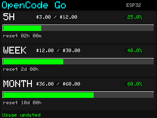

# OpenCode Go LCD

ESP32-2432S028R（ILI9341・320×240）に、OpenCode Goの5時間・週間・月間使用量を表示します。各期間のプログレスバー、使用率、使用済みドル換算額／上限額、リセットまでの時間を確認できます。

この構成では、Windows PCで一度ログインして初期設定を行い、USB経由でESP32へ次の情報を保存します。

- Wi-FiのSSIDとパスワード
- OpenCodeの認証Cookie（`auth=`を含む値）
- ワークスペースID
- 公式ページから取得した動的な取得先ID
- 取得間隔

保存後はESP32がWi-Fiで公式HTTPSサービスへ直接使用量を取得します。PCは終了でき、USBは給電だけにできます。PCの操作画面に表示する使用量カードは、初期設定中のPC接続確認用プレビューです。

2026-09-09に、CA検証付きHTTPS、NTP同期、PC設定アプリ停止中の直接取得、ESP32再起動後の認証保持と60秒間隔の継続更新を実機確認しました。詳しい結果と再検証方法は [verification.md](verification.md) を参照してください。



## 必要なもの

- ESP32-2432S028R（ILI9341）とデータ通信できるUSBケーブル
- Windows PC
- Python 3.12以降、Bun 1.4以降、Firefox
- OpenCode Goを契約しているアカウント
- 初回のファームウェア書き込みに使うPlatformIOとesptool

USB通信は、CH340実機で連続書き込みを確認したPythonのpySerial workerを使います。BunまたはNode.jsからネイティブserialportを直接使う経路は製品USB通信に使用しません。

## 初めて使う

### 1. Pythonとホストの依存関係を入れる

リポジトリを取得し、そのフォルダーでPowerShellを開きます。

```powershell
python --version
python -m pip install -r requirements.txt
bun install --frozen-lockfile
```

ファームウェアのビルドや実機書き込みまで行う開発者は、追加で次を実行します。

```powershell
python -m pip install -r requirements-dev.txt
```

### 2. 元のファームウェアを退避する

ファームウェアを書き換える前に、必ず全フラッシュを退避します。USBポートは一覧で確認し、例の `COM3` を実際の値に置き換えます。

```powershell
bun start ports
powershell -ExecutionPolicy Bypass -File scripts/backup-firmware.ps1 -Port COM3
```

バックアップは `.private/backups/original-flash.bin` に保存され、実機との一致が確認されます。既存ファイルは上書きされません。

### 3. LCD用ファームウェアを書き込む

バックアップが成功し、USBポートを他のアプリが使っていないことを確認してから実行します。

```powershell
pio run -e esp32dev
pio run -e esp32dev -t upload --upload-port COM3
```

### 4. PCでログインし、ESP32へ初期設定を保存する

`start.cmd` をダブルクリックして操作画面を開き、次の順に操作します。

1. **ログイン**を押し、公式画面でGitHubまたはGoogle認証を完了する。
2. **再検索**でUSBポートを表示し、対象ESP32を選んで**接続**する。
3. **ESP32初期設定**でSSID、パスワード、取得間隔を入力し、**ESP32へ保存**を押す。
4. 保存完了応答を確認し、LCDがWi-Fiへ接続して直接更新することを確認する。

PC側のログインはWindows DPAPIで保護して保存します。ESP32へ送る設定には認証Cookie、ワークスペース、動的な取得先IDが含まれます。保存完了後、操作画面の「ESP32の直接更新を確認」を確認できればPCを終了できます。

PCの**このPCのOpenCode認証だけを削除**はPC側の保存情報だけを削除します。ESP32の設定と認証を削除する場合は、USB接続した状態で**ESP32の設定・認証を削除**を押してください。

## 通常運用

LCDへ電源を供給し、ESP32がWi-Fiへ接続できる状態にします。初期設定後はPCを起動する必要がありません。Wi-Fi接続、公式サービスの変更、時刻同期、HTTPS証明書検証のいずれかに失敗した場合は、LCDの状態表示と保存済みデータの時刻を確認してください。

使用量の金額は、Goが制限判定に使うドル換算値です。モデルの倍率を反映するため、実際の請求額と異なる場合があります。上限や使用率をファームウェアへ固定せず、公式応答から取得します。

## LCDの自動消灯と画面設定タブ

本体の **BOOT** ボタンを押して離すと、画面が180度回転します。もう一度クリックすると元の向きへ戻ります。向きは自動保存され、電源を切っても保持されます。反転後も表示された位置でタッチ操作でき、消灯中のBOOTクリックは点灯と反転を同時に行います。長押しでは連続反転しません。

BOOTは起動モードの選択も兼ねるため、電源投入時やRSTによる再起動時には押さず、起動後にクリックしてください。

LCD上部の **Display** タブで、消灯までの時間をいつでも変更できます。9つのボタンから選ぶと、その場で保存されます。**Usage** タブで使用量へ戻ります。

選択肢は **15s / 30s / 1m / 2m / 5m / 10m / 30m / 1h / 2h**、初期値は **1m** です。最後のタッチから設定時間が経過するとバックライトが消灯します。Wi-Fiの自動更新では時間を延長せず、消灯中も使用量の取得は続けます。

消灯中の最初のタッチは再点灯だけに使います。タブや設定を操作する場合は、点灯後にもう一度タッチしてください。設定は再起動後も保持され、変更のためにPCを常時接続する必要はありません。

PCの初期設定画面にも同じ9択があります。USB接続時は **消灯時間を保存** だけで既存のWi-Fi・認証を保持して変更でき、**画面を点灯** で手動点灯できます。

## 秘密情報と復旧

ESP32にはWi-Fiパスワード、認証Cookie、ワークスペース、取得先IDがNVSへ保存されます。通常のESP32フラッシュは暗号化されていないため、機器と全フラッシュバックアップを第三者へ渡さないでください。`.private/` はPC側の認証情報とバックアップを含むため、同期・共有・コミットの対象にしません。

元のファームウェアへ戻す場合は、ホストとUSB接続を停止してから、バックアップを取った同じ機器へ全フラッシュを書き戻します。

```powershell
powershell -ExecutionPolicy Bypass -File scripts/restore-firmware.ps1 -Port COM3
```

復元スクリプトはバックアップのサイズとSHA-256を確認し、書き込み後にも実機との一致を確認します。

## 開発と検証

```powershell
bun run lint
bun run format:check
bun run type-check
python -m mypy --strict host/serial-worker.py
bun run build
bun run test
bun run audit
pio test -e native
pio run -e esp32dev
```

Python側の実行時USBはpySerialです。Node.js 24は開発用のfake fixtureテストだけで使い、製品のUSB通信経路には使いません。

- [更新と復旧](how-to-update.md)
- [取得方式・通信仕様](docs/protocol.md)
- [依存関係とライセンス](docs/dependencies.md)
- [セキュリティ](SECURITY.md)

本プロジェクトはOpenCode非公式です。公式コンソール、認証方式、HTTPS証明書、使用量応答の変更で更新が必要になる場合があります。
